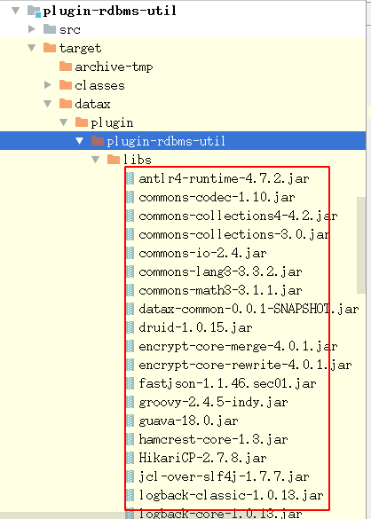

## 2020-04-22 修改增加对sharding-jdbc的支持


### 一、使用方法

1. 添加依赖包到writer或者reader的libs文件夹下，覆盖使用 (覆盖之前请先备份)    
  或者直接使用本项目打包的插件    
        
  [shridng依赖包下载地址](https://gitee.com/timfruit189/sharding-datasource-demo/blob/master/transform-history/transform-datax-config/sharding-jdbc/sharding-plugin-rdbms-util-20200423-1428.zip)      
  
2. 在job.json中的writer或者reader配置中添加
```
"shardingType":"shardingJdbc",
"shardingConfigPath":"job/sharding",
```


相对完整的配置如下:

```
                "writer": {
					"name": "mysqlwriter",
					"parameter": {
						"username": "root",
						"password": "root",
						"writeMode": "replace",
						"column": [
							"order_id",
							"user_id",
							"address_id",
							"status",
							"create_time",
							"update_time"
						],
						"session": [],
						"preSql": [],
						"shardingType":"shardingJdbc",
						"shardingConfigPath":"job/sharding",
						"shardingWarning":"使用了sharding后,将使用shardingConfig (springboot配置格式 .yml)",
						"connection": [
							{
								"jdbcUrl": "jdbc:mysql://127.0.0.1:3306/ds_lab?useSSL=false&useUnicode=true&characterEncoding=UTF-8",
								"table": ["t_order"]
							}
						]
					}
				}
```


其中"shardingConfigPath"为shardingjdbc配置的文件夹, 如果是"/"开头则会当做绝对路径，
否则当做相对路径，相对于datax文件夹        
完整job.json配置位于[core/src/main/job/job-sharding.json](../core/src/main/job/job-sharding.json)


配置文件为sharding jdbc 在springboot中使用的yml配置格式

完整配置示例位于[core/src/main/job/sharding/application-sharding.yml](../core/src/main/job/sharding/application-sharding.yml)   


        


### 二、注意事项
使用datax时，datax默认会将long,int等类型使用string类型替换，
如果是原生数据库，则会进行转换，但是使用sharing-proxy|jdbc则不兼容，
抛出以下异常
```
groovy.lang.MissingMethodException: No signature of method: java.lang.String.mod() is applicable for argument types: (java.lang.Integer) values: [2]
```

本人以对plugin-rdbms-util模块下的com.alibaba.datax.plugin.rdbms.writer.CommonRdbmsWriter进行修改
```
     //----------- 修改了这里 2020-04-22
                // shardng-jdbc  groovy.lang.MissingMethodException: No signature of method: java.lang.String.mod() is applicable for argument types: (java.lang.Integer) values: [2]
                // 如果不改，datax默认使用String类型， sharding-proxy||sharding-jdbc会报错
                case Types.INTEGER:
                    Long iv=column.asLong();
                    if(iv==null){
                        preparedStatement.setString(columnIndex + 1, null);
                    }else {
                        preparedStatement.setInt(columnIndex + 1, iv.intValue());
                    }
                    break;
                case Types.BIGINT:
                    Long lv=column.asLong();
                    if(lv==null){
                        preparedStatement.setString(columnIndex + 1, null);
                    }else {
                        preparedStatement.setLong(columnIndex + 1, lv);
                    }
                    break;
                case Types.DECIMAL:
                    BigDecimal bgv=column.asBigDecimal();
                    if(bgv==null){
                        preparedStatement.setString(columnIndex + 1, null);
                    }else {
                        preparedStatement.setBigDecimal(columnIndex + 1, bgv);
                    }
                    break;
                case Types.DOUBLE:
                case Types.FLOAT:
                    Double dv=column.asDouble();
                    if(dv==null){
                        preparedStatement.setString(columnIndex + 1, null);
                    }else {
                        preparedStatement.setDouble(columnIndex + 1, dv);
                    }
                    break;
                // ----------
                case Types.SMALLINT:
                case Types.NUMERIC:
                case Types.REAL:
                    String strValue = column.asString();
                    if (emptyAsNull && "".equals(strValue)) {
                        preparedStatement.setString(columnIndex + 1, null);
                    } else {
                        preparedStatement.setString(columnIndex + 1, strValue);
                    }
                    break;
```

注意，如果bigint等类型为空，可能还会出错，需要设置默认值